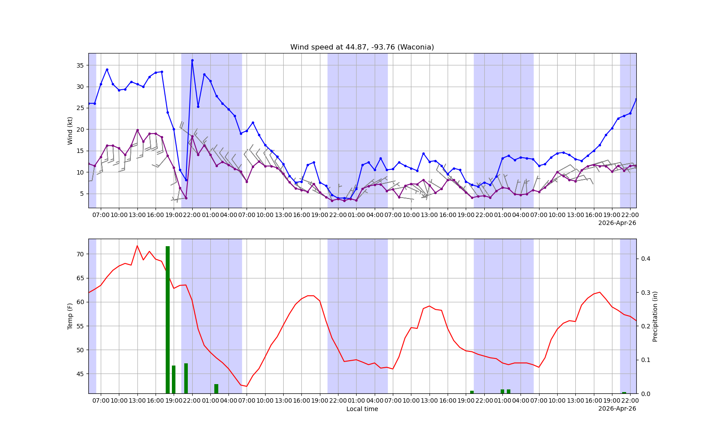
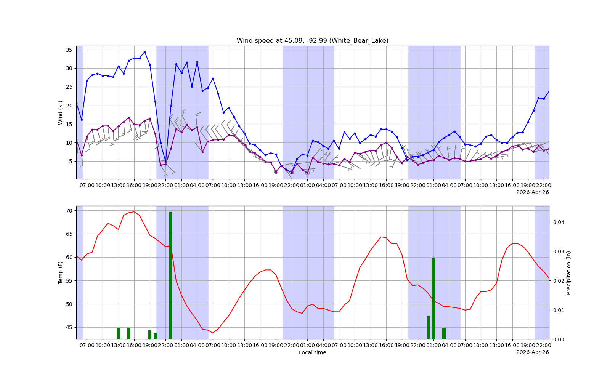
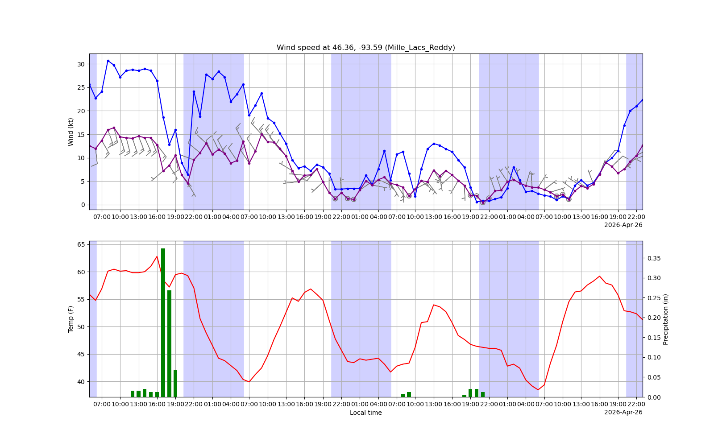
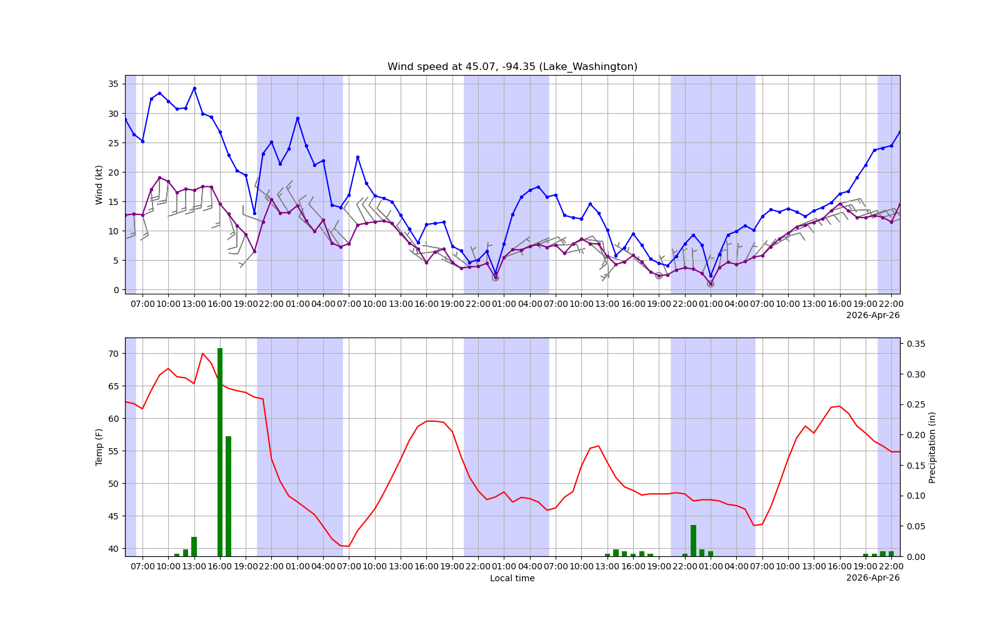
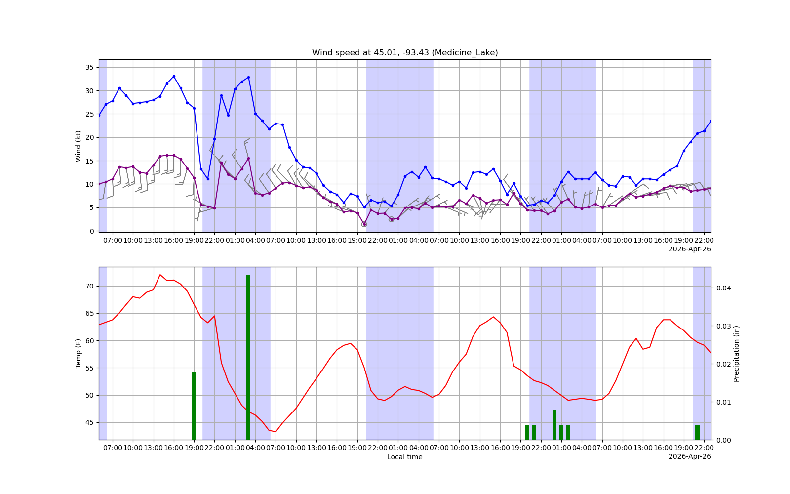
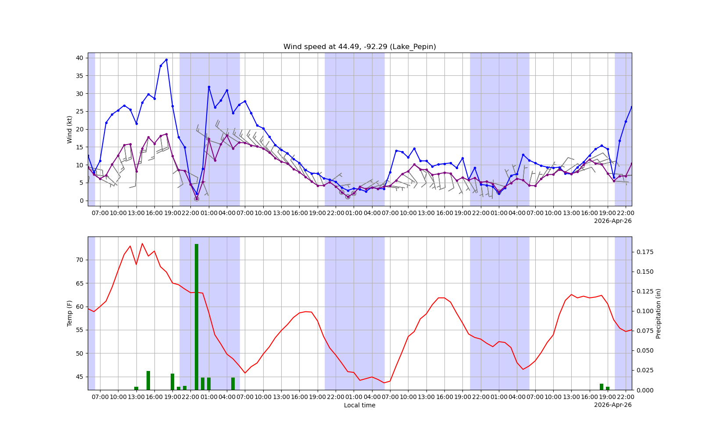
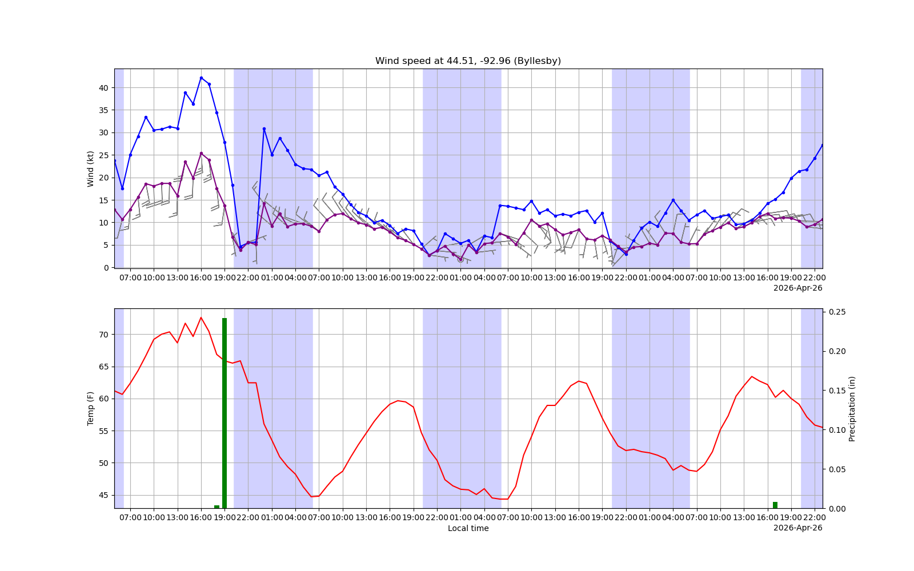
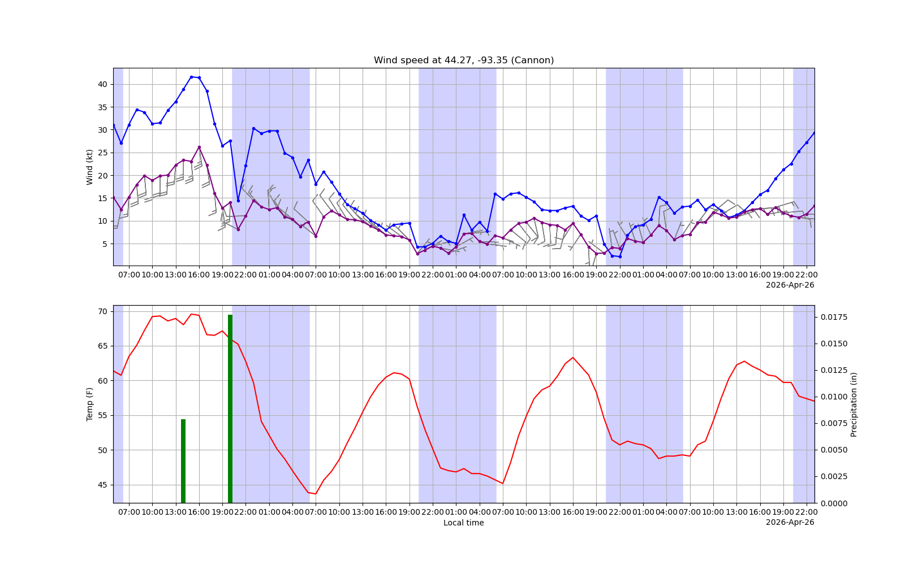
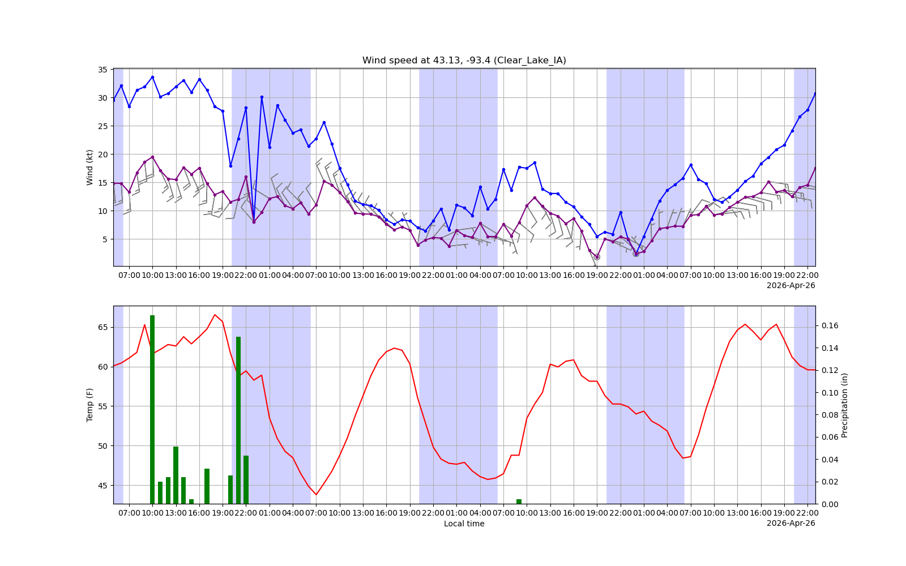
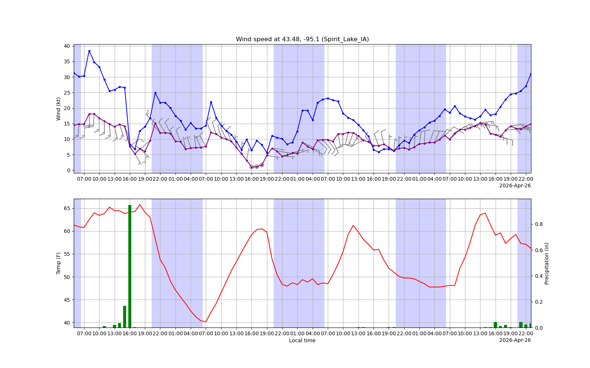

All times in Minneapolis time. Rain forecast seems iffy, so double check that there's no rain. 
Text recommendations will contain rideable periods in the upcoming 4 days. 'Rideable' means
at least 2 consecutive daytime hours with:
- At least 13kts sustained wind
- At least 50F air temp
- At most 0.01in precipitation

 # Forecast at 44.87, -93.76 (Waconia)

Rideable periods:

 - 2026-04-23 from 7:00 to 18:00
 # Forecast at 45.09, -92.99 (White_Bear_Lake)

Rideable periods:

 - 2026-04-23 from 8:00 to 20:00
 # Forecast at 46.36, -93.59 (Mille_Lacs_Reddy)

Rideable periods:

 - 2026-04-23 from 7:00 to 12:00
 # Forecast at 45.07, -94.35 (Lake_Washington)

Rideable periods:

 - 2026-04-23 from 8:00 to 12:00
 - 2026-04-23 from 14:00 to 16:00
 - 2026-04-26 from 15:00 to 18:00
 # Forecast at 45.01, -93.43 (Medicine_Lake)

Rideable periods:

 - 2026-04-23 from 8:00 to 11:00
 - 2026-04-23 from 13:00 to 19:00
 # Forecast at 44.49, -92.29 (Lake_Pepin)

Rideable periods:

 - 2026-04-23 from 11:00 to 13:00
 - 2026-04-23 from 16:00 to 19:00
 # Forecast at 44.51, -92.96 (Byllesby)

Rideable periods:

 - 2026-04-23 from 8:00 to 19:00
 # Forecast at 44.27, -93.35 (Cannon)

Rideable periods:

 - 2026-04-23 from 7:00 to 19:00
 # Forecast at 43.13, -93.4 (Clear_Lake_IA)

Rideable periods:

 - 2026-04-23 from 7:00 to 10:00
 - 2026-04-23 from 15:00 to 17:00
 - 2026-04-26 from 16:00 to 20:00
 # Forecast at 43.48, -95.1 (Spirit_Lake_IA)

Rideable periods:

 - 2026-04-23 from 7:00 to 11:00
 - 2026-04-26 from 9:00 to 15:00
 - 2026-04-26 from 19:00 to 21:00
